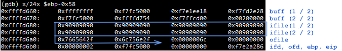

**Narnia Level 3** <br>
narnia3.c: 
```
int main(int argc, char **argv) {

    int  ifd,  ofd;
    char ofile[16] = "/dev/null";
    char ifile[32];
    char buf[32];

    if(argc != 2){
        printf("usage, %s file, will send contents of file 2 /dev/null\n",argv[0]);
        exit(-1);
    }

    /* open files */
    strcpy(ifile, argv[1]);
    if((ofd = open(ofile,O_RDWR)) < 0 ){
        printf("error opening %s\n", ofile);
        exit(-1);
    }
    if((ifd = open(ifile, O_RDONLY)) < 0 ){
        printf("error opening %s\n", ifile);
        exit(-1);
    }

    /* copy from file1 to file2 */
    read(ifd, buf, sizeof(buf)-1);
    write(ofd,buf, sizeof(buf)-1);
    printf("copied contents of %s to a safer place... (%s)\n",ifile,ofile);

    /* close 'em */
    close(ifd);
    close(ofd);

    exit(1);
} 
```

The program takes a file name argument and sends the contents of the file to /dev/null. 
There's appears to be a potential buffer overflow in the program in strcpy.

strcpy function:
```
   strcpy(ifile, argv[1]);
```
strcpy assembly:
```
   0x0804854d <+66>:    mov    0xc(%ebp),%eax <--
   0x08048550 <+69>:    add    $0x4,%eax
   0x08048553 <+72>:    mov    (%eax),%eax
   0x08048555 <+74>:    push   %eax
   0x08048556 <+75>:    lea    -0x38(%ebp),%eax
   0x08048559 <+78>:    push   %eax
   0x0804855a <+79>:    call   0x80483a0 <strcpy@plt>
```
Taking a look at the arguments of strcpy and its assembly, we can deduce that argv[1] exists at 0xc(%ebp) + 4 and ifile exists at -0x38(%ebp). Let's check that this is occurring post strcpy in gdb.

```
(gdb) br * 0x0804855f
Breakpoint 1 at 0x804855f
(gdb) r
Starting program: /narnia/narnia3 $(python -c 'print "\x90"*31')

Breakpoint 1, 0x0804855f in main ()
(gdb) x/8x $ebp-0x38
0xffffd680:     0x90909090      0x90909090      0x90909090      0x90909090
0xffffd690:     0x90909090      0x90909090      0x90909090      0x00909090
```

Yup! It's working as intended. The buffer is 32 bytes long. Anything over that will overwrite registers under ebp, like this: 

So it looks like we are able to manipulate ofile which currently hosts /dev/null. (2f 64 65 76 2f 6e 75 6c 6c) We could input the contents of /etc/narnia_pass/narnia4 to the program and have it transferred to a file of our choosing! In our case, I will attempt to write to /tmp/bbb. (2f 74 6d 70 2f 62 62 62)

