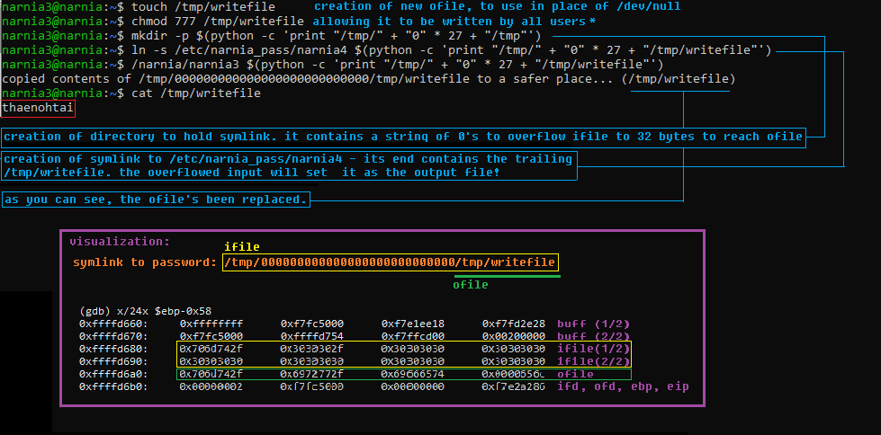

**Narnia Level 3** <br>
narnia3.c: 
```
int main(int argc, char **argv) {

    int  ifd,  ofd;
    char ofile[16] = "/dev/null";
    char ifile[32];
    char buf[32];

    if(argc != 2){
        printf("usage, %s file, will send contents of file 2 /dev/null\n",argv[0]);
        exit(-1);
    }

    /* open files */
    strcpy(ifile, argv[1]);
    if((ofd = open(ofile,O_RDWR)) < 0 ){
        printf("error opening %s\n", ofile);
        exit(-1);
    }
    if((ifd = open(ifile, O_RDONLY)) < 0 ){
        printf("error opening %s\n", ifile);
        exit(-1);
    }

    /* copy from file1 to file2 */
    read(ifd, buf, sizeof(buf)-1);
    write(ofd,buf, sizeof(buf)-1);
    printf("copied contents of %s to a safer place... (%s)\n",ifile,ofile);

    /* close 'em */
    close(ifd);
    close(ofd);

    exit(1);
} 
```

The program takes a file name argument and sends the contents of the file to /dev/null. 
There's appears to be a potential buffer overflow in the program in strcpy.

strcpy function:
```
   strcpy(ifile, argv[1]);
```
strcpy assembly:
```
   0x0804854d <+66>:    mov    0xc(%ebp),%eax <--
   0x08048550 <+69>:    add    $0x4,%eax
   0x08048553 <+72>:    mov    (%eax),%eax
   0x08048555 <+74>:    push   %eax
   0x08048556 <+75>:    lea    -0x38(%ebp),%eax
   0x08048559 <+78>:    push   %eax
   0x0804855a <+79>:    call   0x80483a0 <strcpy@plt>
```
Taking a look at the arguments of strcpy and its assembly, we can deduce that argv[1] exists at 0xc(%ebp) + 4 and ifile exists at -0x38(%ebp). Let's check that this is occurring post strcpy in gdb.

```
(gdb) br * 0x0804855f
Breakpoint 1 at 0x804855f
(gdb) r
Starting program: /narnia/narnia3 $(python -c 'print "\x90"*31')

Breakpoint 1, 0x0804855f in main ()
(gdb) x/8x $ebp-0x38
0xffffd680:     0x90909090      0x90909090      0x90909090      0x90909090
0xffffd690:     0x90909090      0x90909090      0x90909090      0x00909090
```

Yup! It's working as intended. The buffer is 32 bytes long. Anything over that will overwrite registers under ebp, like this: 

Through this overflow, it looks like one could overwrite ofile, ibp, obp, ebp, eip, and more! In this case we'll only need to overwrite ofile, as it'll enable us to read the password to the next level:



What is a symlink and why do we need it? A symlink functions very similarly to a shortcut in Windows. It's a file that points to another file. /etc/narnia_pass/narnia4 does not have the sufficient bytes to overflow ifile so we are creating a shortcut that points to it with a longer name. 
And there we have it! We can now move on to level 4.

